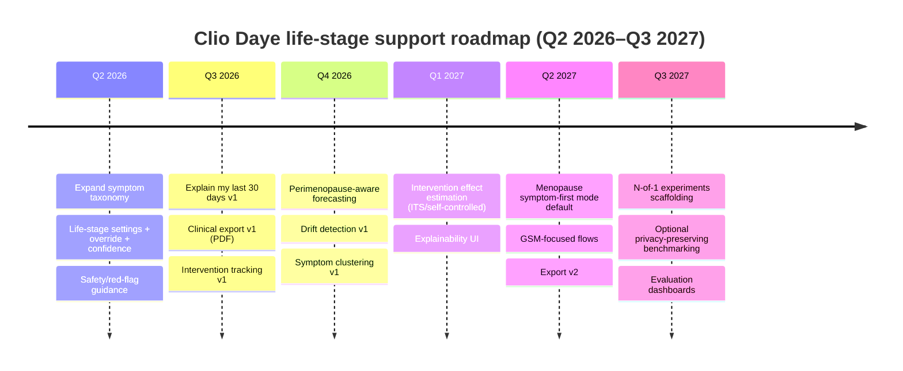

# Translating Clio Daye from tracking to life‑stage menopausal support

## Executive summary

Clio Daye’s current tracker (daily flow, mood, symptom log; cycle/phase forecasts; multi‑month history and log view) is well positioned to evolve into a life‑stage product because it already has three essential ingredients: longitudinal data capture, a forecasting mental model, and a trust-first posture (open-source/privacy stance).fileciteturn0file0

To become “more” than a tracker, the product needs to shift from **recording → interpreting → supporting action**, especially as users move into perimenopause and menopause where cycles become less predictable and symptoms span multiple systems. Clinically, the menopausal transition is defined by characteristic changes in menstrual cycle variability (early transition) and longer gaps of amenorrhea (late transition), and menopause itself is a retrospective diagnosis after a sustained absence of menses.citeturn3search2turn0search3turn3search5turn3search1

In parallel, the user’s primary “job to be done” changes. In perimenopause and menopause, users often need help with **vasomotor symptoms and sleep**, **mood/anxiety and cognition (“brain fog”)**, **genitourinary and sexual symptoms**, and **musculoskeletal pain**, plus psychological needs like validation, reduced uncertainty, and better clinical self‑advocacy.citeturn2search3turn1search3turn0search2turn1search6turn2search12turn3search3

A credible 12–18 month transformation path is to deliver four “product pillars,” in priority order:

1) **Life‑stage adaptive experience** (pre‑menopause → perimenopause → menopause) with explicit confidence/uncertainty and user override, grounded in STRAW+10 staging signals.citeturn3search2turn0search3  
2) **Symptom‑first tracking and summaries** (hot flashes/night sweats, sleep quality, cognition, genitourinary/sexual health, musculoskeletal pain) with a monthly narrative like “Explain my last 30 days.”citeturn0search6turn2search3turn2search12turn1search3turn1search6turn3search3  
3) **Intervention tracking + outcome estimation** (within-person, quasi‑experimental methods) to answer “what helps me” without over-claiming causality.citeturn6search2turn6search14turn9search7  
4) **Clinical conversation export** to address common experiences of feeling unsupported or not taken seriously, by converting logs into visit-ready summaries and timelines.citeturn4search0turn4search15

Privacy and regulatory guardrails must be designed in from the start. In the U.S., health apps can fall under FTC health data expectations (including breach notification duties in relevant circumstances) and must avoid “clinical decision support” behaviors that push the product toward regulated medical device status without appropriate controls.citeturn5search2turn5search6turn5search0

## User needs across life stages

### Clinical life‑stage signals to anchor adaptation

A practical product definition (non-diagnostic) can align with the STRAW+10 framework:

- **Pre‑menopause (reproductive stages):** cycles typically more regular; ovulatory patterns more common.citeturn0search3  
- **Early perimenopause / early menopausal transition (STRAW stage –2):** increased menstrual cycle length variability, operationalized as a persistent ≥7‑day difference in cycle length recurring within 10 cycles.citeturn3search2turn8search5  
- **Late perimenopause / late menopausal transition (STRAW stage –1):** longer episodes of amenorrhea (commonly ≥60 days) and increased anovulatory cycles.citeturn8search5turn8search1  
- **Menopause:** a point in time defined retrospectively after 12 months without a menstrual period (final menstrual period “confirmed” after that interval).citeturn3search5turn3search1  

These signals are crucial because Clio Daye’s current cycle prediction approach assumes comparatively stable cycle structure (e.g., estimating ovulation as average cycle length minus 14 days, and fixed luteal length), which becomes less reliable as variability and anovulation increase.fileciteturn0file0

### Physical needs that grow in importance beyond “flow”

Across perimenopause and menopause, the symptom surface area broadens:

- **Vasomotor symptoms (hot flashes/night sweats):** experienced by a large share of women across the transition, and strongly linked with sleep disruption and quality‑of‑life impact.citeturn2search3turn2search7turn3search0turn1search3  
- **Sleep disturbances:** commonly reported and often associated with vasomotor symptoms; sleep becomes both a symptom and a driver of downstream mood/cognition impact.citeturn1search3turn1search15  
- **Mood symptoms (irritability, anxiety, depressive symptoms):** common in perimenopause; evidence suggests increased risk of depressive symptoms/diagnoses during perimenopause compared with premenopause.citeturn0search2turn1search0  
- **Cognitive complaints (“brain fog,” memory/focus problems):** commonly reported around the transition, though the relationship between subjective complaints and objective measures can be complex; users still need practical support for functioning and self-trust.citeturn1search6turn1search21turn1search2  
- **Genitourinary syndrome of menopause (GSM):** vulvovaginal and urinary symptoms (dryness, dyspareunia, urinary urgency/frequency, recurrent UTIs) that are underdiscussed and can persist without treatment.citeturn2search12turn2search8turn2search4turn2search1  
- **Bleeding changes and AUB vigilance:** irregular bleeding is common in perimenopause, but certain patterns require evaluation; a product should include “when to seek care” guardrails and avoid normalizing red-flag bleeding.citeturn0search6turn2search2  
- **Musculoskeletal pain:** evidence indicates increased risk of muscle/joint pain around the menopause transition, which users may not associate with hormonal change.citeturn3search3turn3search15  

### Psychological needs that trackers rarely solve

Qualitative and mixed‑methods literature consistently highlight “felt experience” gaps:

- **Validation and epistemic justice:** women report feeling unsupported or not taken seriously, contributing to confusion and delayed care.citeturn4search15turn4search0  
- **Workplace impact and stigma:** cognitive symptoms (“brain fog”) and symptom management in the workplace show up as a distinct stressor; users need language and artifacts for self-advocacy.citeturn4search1turn4search5  
- **Trust and privacy risk perception:** menopause tech can be perceived as sensitive and potentially exploitable (e.g., discrimination or misuse), meaning trust-first design can be a primary differentiator rather than a “nice-to-have.”citeturn4search14turn4search3  
- **Sensemaking under variability:** perimenopause is characterized by “pattern drift”—users are less able to predict themselves, which can increase anxiety and self-doubt (and is reflected in increased depressive symptom risk).citeturn3search2turn1search0  

Implication: the “earth shattering” opportunity is not new charts; it’s **sensemaking + safer action support**, delivered with privacy and explainability.

## Prioritized product capabilities mapped to needs and life stages

### Capability portfolio by horizon, priority, and effort

The table below is designed as a **prioritized backlog**. Priority is relative (P0 highest). Effort assumes a lean mobile team and unknown scale; revise once engineering constraints are known.

| Capability | Primary life stage(s) | Primary user need(s) addressed (physical + psychological) | Horizon | Priority | Effort | Key success metric(s) |
|---|---|---|---|---:|---:|---|
| Life‑stage detection + user override (based on cycle variability/amenorrhea; “confidence” shown) | Pre → peri → meno | Reduce uncertainty; adapt product model; avoid misleading fertility/phase cues | Short | P0 | M | % users with stage set; override rate; trust/NPS for “accuracy” |
| Expanded symptom taxonomy (VMS, sleep, cognition, GSM, musculoskeletal) + symptom‑first mode toggle | Peri + meno | Track what matters; validation; reduce “invisible symptoms” | Short | P0 | M | Symptom logging coverage; weekly active use; completion time |
| “Explain my last 30 days” summary (changes, clusters, likely drivers, uncertainty, red flags) | Peri + meno | Sensemaking; self‑trust; reduce overwhelm | Short | P0 | L | Summary open rate; “helpfulness” rating; retention lift |
| Intervention tracker (start/stop, adherence, side effects) | Peri + meno | “What helps me?”; reduce trial‑and‑error burden | Short | P0 | M | % users tracking interventions; adherence logging rate |
| Clinical conversation export (visit summary PDF + timeline + question prompts) | Peri + meno | Self‑advocacy; counter dismissal; reduce visit prep stress | Short | P1 | M | Export generation rate; post-visit usefulness rating |
| Red‑flag guardrails (bleeding-after-menopause, heavy bleeding, severe symptoms; non-diagnostic) | Peri + meno | Safety; reduce false reassurance | Short | P1 | S | CTR on safety guidance; self-reported “I sought care” |
| Perimenopause-aware cycle forecasting (distributional forecasts; degrade fertile/ovulation emphasis as uncertainty rises) | Peri | Avoid misleading predictions; reduce frustration | Medium | P1 | L | Calibration error; “prediction confidence understood” |
| Drift detection (“something changed”) alerts (cycle variability, VMS frequency, sleep disruption) | Peri + meno | Early signal detection; reduce self-doubt | Medium | P1 | M | Precision/acceptance of alerts; churn reduction |
| Symptom clustering and “syndromes” (e.g., sleep+VMS cluster) | Peri + meno | Make patterns legible; target interventions | Medium | P2 | M | Cluster stability; perceived insight score |
| Intervention effect estimation (within-person ITS / self-controlled comparisons; “evidence grade”) | Peri + meno | Decision support without overclaiming | Medium | P1 | L | % interventions with measurable effect; trust score |
| Personalized “experiments” (N-of-1 trial scaffolding, reminders, washout) | Peri + meno | Faster learning; empowerment | Long | P2 | L | Experiment completion rate; effect detectability |
| Optional wearables import (sleep, temp proxy) with local-first processing | Peri + meno | Reduce logging burden; improve signal | Long | P3 | L | % connected; missingness reduction |
| Private population benchmarking (opt-in; privacy-preserving aggregates only) | All | Validation: “you’re not alone”; expectation-setting | Long | P3 | L | Opt-in rate; perceived reassurance; privacy trust |

### Why these capabilities “fit” the evidence

- Centering VMS and sleep is justified because VMS are common across the transition and are strongly associated with sleep disturbance; duration can extend for years, so people need longitudinal support beyond near-term “forecasting.”citeturn2search3turn1search3turn3search0turn3search8  
- Prioritizing mood/cognition is supported by evidence of increased risk of depressive symptoms in perimenopause and widespread reports of cognitive complaints around the transition.citeturn1search0turn1search21turn0search2  
- Clinical export and structured summaries are supported by qualitative findings of poor care experiences and feeling dismissed; the product can provide “proof” without claiming diagnosis.citeturn4search15turn4search0  
- Privacy-first positioning is strengthened by recent privacy-attitudes research specific to menopause tech, plus U.S. enforcement signaling that “health app data” is treated as sensitive and misuse can trigger regulatory action.citeturn4search14turn5search3turn5search10  

## Roadmap with milestones, timelines, roles, and success metrics

### Assumptions for planning

- Timeframe: **Q2 2026–Q3 2027** (18 months), aligned to the current date (2026‑04‑10).  
- Unknowns: user base size, server architecture, and telemetry posture are unspecified; roadmap therefore emphasizes **local-first value** with opt‑in, privacy-preserving measurement.  
- Guiding principle: keep the app clearly in “wellness + self-management + visit-prep,” avoiding diagnostic/treatment recommendations that would increase regulatory risk.citeturn5search0turn5search1  

### Quarter-by-quarter roadmap table

| Quarter | Milestones and deliverables | Required teams / roles | Success metrics (leading → lagging) |
|---|---|---|---|
| Q2 2026 | **Foundation for life-stage support**: (a) Expand symptom taxonomy (VMS, sleep, cognition, GSM, musculoskeletal); (b) “Life-stage settings” screen with user override + confidence; (c) Update onboarding to capture goals (predict vs manage symptoms) and optional age range; (d) Add red-flag guidance copy and flows (non-diagnostic). | iOS engineer(s); product; UX; clinical advisor (OB‑GYN/menopause specialist); security/privacy engineer; content designer | Leading: onboarding completion, % enabling life-stage, log completion time. Lagging: week‑4 retention, help-center “confused” tickets |
| Q3 2026 | **Summaries and clinical export**: (a) “Explain my last 30 days” v1 (rule-based insights + uncertainty); (b) Clinical conversation export v1 (PDF); (c) Intervention tracking v1 (start/stop, category, adherence). | iOS; UX; clinical advisor; data/ML (for derived metrics); QA; legal review for phrasing | Leading: summary open rate, export rate, intervention adoption. Lagging: retention lift vs baseline cohort, NPS delta |
| Q4 2026 | **Perimenopause-aware forecasting and drift**: (a) Forecast degradation logic based on variability/amenorrhea; (b) Drift detection v1 (cycle variability + symptom frequency); (c) Symptom clustering v1 (on-device). | iOS; applied ML; clinical advisor; QA; analytics engineer (privacy-preserving) | Leading: alert acceptance rate, reduced “wrong prediction” complaints. Lagging: churn reduction in high-variability users |
| Q1 2027 | **Intervention effect estimation**: (a) Within-person “impact cards” using interrupted time series/self-controlled windows; (b) Explanation UI (“why we think this helped”) with lightweight model interpretability; (c) Safety layer for high-risk interpretations (always “talk to a clinician”). | Applied ML/data science; iOS; UX; clinical advisor; legal/compliance | Leading: % interventions with sufficient data, comprehension scores. Lagging: sustained engagement with interventions |
| Q2 2027 | **Menopause mode maturation**: (a) Symptom-first home screen option becomes default for “menopause stage”; (b) GSM-focused flows, sexual/urinary symptom tracking with sensitive UX; (c) Export v2: visit-prep checklists (sleep, VMS, mood, GSM) | iOS; UX; clinical advisor; accessibility specialist; privacy/security | Leading: adoption of symptom-first; GSM logging opt-in; export usefulness rating. Lagging: retention in postmenopause cohort |
| Q3 2027 | **Personalization and experiments**: (a) “My experiments” scaffolding (N-of-1 protocol templates; reminders; washout); (b) Optional aggregated benchmarking (privacy-preserving opt-in only); (c) Internal evaluation framework (offline replay, calibration dashboards) | Applied ML; iOS; product; privacy/security; research ops | Leading: experiment completion rate; opt-in rate. Lagging: improvements in symptom burden scores (self-reported) |

### Milestone timeline diagram



## Data model and privacy architecture

### Current baseline (from your spec)

Clio Daye’s core record is a day-level model (CycleDay: date, flow intensity, symptom set, single mood, notes) plus onboarding seed priors and a cycle prediction engine that detects periods, computes a weighted recency average over recent cycles, uses sample standard deviation for uncertainty, and estimates ovulation/fertile window via an “avgCycleLength − 14” heuristic.fileciteturn0file0

That schema is a good foundation, but perimenopause and menopause require:

- **Richer symptom domains** (especially VMS, sleep, GSM, cognition, musculoskeletal).citeturn2search3turn1search3turn2search12turn1search6turn3search3  
- **Event-like symptoms** (VMS episodes) vs purely daily presence/absence.citeturn2search3  
- **Interventions and exposures** that may explain changes (HRT, nonhormonal meds, CBT, lifestyle).citeturn0search12turn7search0turn7search9  

### Proposed logging schema extension

Below is a pragmatic “v1” expansion that targets the highest-value clinical domains while minimizing burden and privacy risk.

#### New daily fields (user entered)

**Core**
- `energy_level` (0–4)
- `stress_level` (0–4)
- `sleep_quality` (0–4) + optional `sleep_duration_hours` (numeric)
- `cognitive_clarity` (0–4) (a “brain fog” proxy)

**Vasomotor**
- `hot_flash_count` (0, 1–2, 3–5, 6+) and `hot_flash_severity` (0–3)
- `night_sweats` (none / mild / moderate / severe)

**Genitourinary / sexual (opt‑in module)**
- `vaginal_dryness` (0–3)
- `pain_with_sex` (0–3; “not applicable” option)
- `urinary_urgency_frequency` (0–3)
- `recurrent_UTI_flag` (yes/no; optionally date of diagnosis)

**Musculoskeletal**
- `joint_muscle_pain` (0–3)
- `exercise_recovery` (0–3)

**Bleeding nuance (to support perimenopause)**
- `bleeding_volume` (already via flow intensity)
- add `bleeding_duration_minutes` optional? (often too burdensome)
- add `bleeding_clots` (none/some/many) and `bleeding_interference` (0–3) as AUB screening proxies, with careful safety messaging.citeturn2search2  

#### Intervention/exposure model (new table)

- `Intervention`
  - `id`, `name`, `category` (HRT, SSRI/SNRI, NK3 antagonist, CBT, supplement, exercise protocol, diet change, sleep hygiene, vaginal estrogen/moisturizer/lubricant, etc.)
  - `start_date`, `stop_date`
  - `dose_or_intensity` (free text + optional structured dose)
  - `adherence` (on/off per day or % per week)
  - `side_effects_tags` + notes

This aligns with guideline-recognized therapy categories—HT, nonhormonal prescription options for VMS, and menopause-specific CBT—without embedding medical advice or dosages as defaults.citeturn0search12turn7search0turn7search9turn7search3  

#### Derived life-stage fields (computed)

- `cycle_length_days` (from detected period starts)
- `cycle_variability_sd_6` and `cycle_variability_cv`
- `amenorrhea_run_length_days` (days since last non-spotting flow run)
- `stage_confidence` (0–1) + `stage_reason_codes` (e.g., “≥7-day variability recurring,” “≥60-day amenorrhea,” “12 months without bleeding”)citeturn3search2turn8search5turn3search5  

### On‑device vs server processing

Given menopause-tech privacy concerns and the sensitivity of sexual/urinary and mental health–adjacent data, a **default local-first architecture** is strategically aligned with user trust and risk mitigation.citeturn4search14turn4search3

**On-device (default)**
- All raw logs (daily + interventions)
- All derived metrics (stage inference, drift detection, clustering, effect estimation)
- All summaries (“Explain my last 30 days”)
- Clinical export generation

**Server (strictly minimal, optional)**
- If accounts exist: authentication metadata only (no health content)
- Optional E2E-encrypted backup/sync where server never sees plaintext (key material stays client-side)
- Optional research contribution using privacy-preserving aggregation (see below)

### Privacy constraints and retention policies

**Constraints**
- Data minimization: collect only what is needed for user-facing features.
- No third-party advertising SDKs and no health-data sharing with ad platforms, given enforcement history around health data disclosures.citeturn5search3turn5search11  
- Meet or exceed expectations implied by FTC health data guidance and breach notification–related obligations for relevant entities.citeturn5search2turn5search10turn5search6  

**Retention**
- **On-device:** default indefinite with explicit controls: export, delete ranges, “delete all,” and automatic “sensitive module” purge options (e.g., GSM module) if user disables it.
- **Server:** if E2E sync is offered, retention mirrors user policy; deleted data is cryptographically unrecoverable once keys are rotated/destroyed.
- **Telemetry:** opt-in only; store aggregated counters (e.g., “summary opened”) with short TTL (e.g., 30–90 days) and no raw health content.

### Data flow diagram

```mermaid
flowchart LR
    A[User logs daily data\n(flow, symptoms, mood, notes,\nVMS/sleep/GSM/cognition,\ninterventions)] --> B[Encrypted on-device store]
    B --> C[On-device feature pipeline\n- stage inference\n- drift detection\n- clustering\n- effect estimation]
    C --> D[UX surfaces\nExplain last 30 days\nImpact cards\nAdaptive home screen]
    C --> E[Clinical export generator\n(PDF + timeline + prompts)]
    B -. optional E2E sync .-> F[Sync server\n(no plaintext)]
    C -. optional opt-in aggregates .-> G[Privacy-preserving analytics\n(cohort-level only)]
```

## Analytics and personalization approach

This section provides an implementable analytics plan that is **life-stage aware**, **local-first**, and **explainable by design**.

### Pattern-drift detection

Goal: detect “something changed” in cycle patterns or symptoms without over-alerting.

**Signals**
- Cycle: `cycle_length_days`, `cycle_variability_sd_6`, amenorrhea run length.citeturn3search2turn8search5  
- Symptoms: VMS frequency/severity, sleep quality, mood valence/variability, cognition.citeturn2search3turn1search3turn1search21turn0search2  

**Algorithms (tiered)**
- **EWMA/CUSUM-style change detection** for univariate streams (e.g., sleep quality) with personal baseline windows and guardrails for missingness; CUSUM is a long-established method for sequential change detection.citeturn6search1  
- **Bayesian Online Change Point Detection** for multivariate or noisier streams where you want a probability of a “regime shift” (e.g., increased VMS + reduced sleep).citeturn6search0turn6search4  

**Mitigations to reduce harm**
- Require persistence (e.g., ≥10–14 days) before notifying.
- Present as “pattern change” rather than “condition change.”
- Provide user controls (“snooze,” “less of this”) to avoid anxiety amplification.

### Symptom clustering and “syndrome” surfacing

Goal: help users see recurring bundles like “VMS + insomnia” or “sleep drop + irritability,” which can guide discussions and self-management.

**Representation**
- Binary symptom matrix + ordinal severities, with time windows (weekly aggregates).
- Use cosine/Jaccard similarity for sparse binary symptoms; include severity via weighted distances.

**Algorithms**
- On-device clustering using **hierarchical density-based methods** (robust to noise/outliers and does not require pre-specifying cluster count), e.g., HDBSCAN-like approaches.citeturn9search2  
- For small personal datasets, fall back to rule-based co-occurrence mining (top pairs/triads) to avoid unstable ML.

**Outputs**
- “Your top 2 symptom clusters this month”
- “Cluster A occurs most often after nights with low sleep quality”

All outputs must clearly indicate uncertainty and be framed as observational.

### Phase-aware models across life stages

**Pre‑menopause**
- Continue cycle-phase modeling, but treat fertile window/ovulation outputs carefully (avoid contraception claims).
- Improve accuracy messaging: calendar-based ovulation prediction is imperfect; fertile window estimation varies across individuals.citeturn8search23turn8search15  

**Perimenopause**
- Replace strong phase claims with **probabilistic windows**:
  - Stage-aware forecasting that widens uncertainty as cycle variability increases (consistent with STRAW+10 variability criteria).citeturn3search2turn8search5  
- Reduce emphasis on “ovulation day” given increased anovulation/variability and evidence that simple calendar methods can be unreliable.citeturn8search23turn8search1  

**Menopause**
- No cycle anchor; use:
  - Baseline modeling and symptom seasonality (weekly/monthly patterns)
  - Intervention effect cards
  - Longitudinal trajectories (e.g., VMS trend over 6 months), aligned to evidence that symptoms may persist for years.citeturn3search0turn3search8  

### Intervention effect estimation

Goal: provide “what seems to help me” evidence without making causal claims that exceed the data.

**Default approach: within-person quasi-experimental designs**
- **Interrupted Time Series (ITS)** at the individual level: estimate level/slope changes after an intervention start, adjusting for autocorrelation and concurrent trends (sleep, stress). ITS is a standard quasi-experimental evaluation method when RCT is not feasible.citeturn6search2turn6search14  
- **Self-controlled case series / within-person matched windows**: compare symptom burden in matched pre/post windows (same day-of-week distribution, similar baseline stress).  

**Optional advanced: N-of-1 experiment scaffolding**
- Use structured “A/B” periods with reminders and washouts.
- Interpret results as personal evidence; N-of-1 designs are a recognized approach for personalized evaluation.citeturn9search7turn9search19  

**Output: “Evidence grade”**
- Grade based on data sufficiency and confounding risk (e.g., A = repeated cycles with stable baseline; C = too much missingness).
- Always show “possible confounders observed” (travel, illness, major stress).

### Personalization strategy

A privacy-preserving, technically credible personalization approach:

- **Local priors + Bayesian updating:** initialize symptom baselines from general priors, then rapidly adapt to the individual’s distribution.
- **Life-stage gating:** models switch features/weights depending on stage confidence (e.g., cycle-based predictions downweighted in late perimenopause).
- **Opt-in federated/aggregate learning (later):** only if it can be done without collecting raw health data; consider it an advanced phase, given menopause tech privacy concerns.citeturn4search14turn4search3  

### Explainability design

Explainability is a product requirement, not a model add-on—especially because FDA guidance on CDS emphasizes transparency and appropriate presentation of information.citeturn5search0

**Recommendation**
- Prefer **rule-based explanations** for the first versions of summaries and effect cards (e.g., “Sleep quality fell after night sweats increased”).
- If ML explanations are used, implement model-agnostic feature attribution such as SHAP or LIME, and translate into human language carefully.citeturn9search0turn9search1  

## UX and feature specifications

### “Explain my last 30 days” specification

**User promise:** “Turn my logs into a comprehensible story—what changed, what might be driving it, and what to do next—without making medical claims.”

**Inputs**
- Daily symptoms (expanded), mood, sleep, VMS, interventions, bleeding.
- Stage confidence and trend metrics.

**Outputs (structured)**
- **What changed:** top 3 changes vs previous 30 days (e.g., “Night sweats increased; sleep quality decreased”).  
- **Your clusters:** “These symptoms traveled together.”  
- **Your likely drivers (observational):** show correlations with uncertainty and “could be confounded.”  
- **What helped (if any):** intervention impact cards with evidence grade.  
- **Red flags / seek care:** always visible, stage-sensitive (e.g., bleeding after menopause is a distinct safety prompt).citeturn2search2turn3search5  

**Tone and mental model**
- Explicitly validate experience without pathologizing.
- Replace deterministic language with “pattern suggests / may be associated.”

### Clinical conversation export

This feature directly addresses reported care gaps (feeling dismissed, unsupported), by converting longitudinal logs into clinician-friendly artifacts.citeturn4search15turn4search0

**Export contents**
- Life-stage indicator (user-selected + inferred confidence)
- Timeline: bleeding, VMS intensity, sleep quality, mood variability, GSM symptoms (if enabled)
- Intervention history and perceived effects
- “Most disruptive symptoms” ranked by frequency/severity
- Question prompts:
  - “What diagnoses should be ruled out with my bleeding pattern?”
  - “What are evidence-based options for VMS and sleep?”
  - “What are options for GSM symptoms?”

**Formats**
- PDF for universal sharing
- Optional structured summary (FHIR-like) later, if you choose interoperability

### Intervention tracking UX

**Core design**
- Add intervention from curated categories (HRT / nonhormonal Rx / CBT / lifestyle / supplement / local vaginal treatments)
- “Start date” and “expected time to notice change” (education-only, citing guideline-based ranges when available)
- Adherence is lightweight (yes/no today) to avoid burden.

This aligns with evidence that both hormone therapy and nonhormone prescription therapies are used for VMS, and menopause-specific CBT is recommended as an option for VMS, sleep, or depressive symptoms associated with menopause.citeturn0search12turn7search0turn7search9  

### Adaptive onboarding

**Objectives**
- Identify primary goals: prediction, symptom management, clinical prep, or all.
- Offer “modules” with explicit consent: GSM/sexual health module is opt-in and can be locally protected with extra lock.

**Questions (minimal, optional)**
- Are you having periods regularly?
- Have you gone 60+ days without a period recently? (late perimenopause signal)citeturn8search5  
- How important are: hot flashes/night sweats, sleep, mood, brain fog, sexual/urinary symptoms?
- Optional: age range (binned) for baseline calibration (never required)

### Life-stage UI changes

**Pre‑menopause UI**
- Cycle-centered home
- Phase card + forecast grid remains primary
- Encourage symptom tracking and “PMS patterns”

**Perimenopause UI**
- Home becomes “two-track”:
  - Cycle track with uncertainty and “variability notices”
  - Symptom track prioritized (VMS, sleep, mood)
- Forecast UI de-emphasizes ovulation certainty to avoid misleading signals.citeturn8search23turn8search1  

**Menopause UI**
- Symptom-first home (default)
- Monthly summaries and intervention impact are the product center
- Cycle forecasting becomes historical reference only (“time since last bleed” with safety messaging).citeturn3search5turn2search2  

## Research & evidence, regulatory/privacy considerations, and implementation risks

### Prioritized sources to validate and calibrate features

Below are high-leverage, primary/official sources to build the product’s evidence layer and guardrails (ordered by “product impact per read”).

- entity["organization","The Menopause Society","professional society menopause US"] position statements: hormone therapy guidance; nonhormone therapy options; GSM management.citeturn0search12turn7search0turn2search12turn2search4  
- entity["organization","American College of Obstetricians and Gynecologists","ob-gyn professional org US"] patient and clinical resources on perimenopause/menopause symptoms, mood changes, and bleeding changes.citeturn0search6turn0search2turn2search2turn0search14  
- entity["organization","National Institute for Health and Care Excellence","clinical guidance body UK"] guideline NG23 (updated 2024), including recommendations and decision aids (notably for CBT and genitourinary symptoms).citeturn0search1turn7search9turn2search9  
- entity["organization","World Health Organization","UN health agency"] menopause fact sheet (definitions, age ranges, framing of menopause as a life stage).citeturn3search1  
- STRAW+10 staging and operational definitions for early transition variability; foundational for life-stage inference and UI adaptation.citeturn0search3turn3search2turn8search5  
- entity["organization","Study of Women's Health Across the Nation","longitudinal cohort study US"]–derived evidence on VMS prevalence and duration to set expectations and prioritize longitudinal support.citeturn2search7turn3search0turn2search11  
- Meta-analysis on depression risk across menopausal stages to justify mood-focused support and careful framing.citeturn1search0  
- Qualitative and mixed-methods studies on (a) barriers to menopause support and (b) app roles in empowerment/epistemic injustice for UX tone and clinical export design.citeturn4search0turn4search2turn4search15  
- Menopause-tech privacy attitudes research to validate local-first architecture decisions and consent language.citeturn4search14turn4search3  

### Regulatory and privacy considerations

**Avoiding unintended “medical device” scope**
- If the product begins recommending specific treatments, dosing, or “diagnosing” perimenopause/menopause, regulatory exposure increases. FDA guidance distinguishes categories of clinical decision support and emphasizes scope and presentation.citeturn5search0turn5search1  
- Mitigation: position outputs as **observational summaries, trend detection, and visit preparation**, with explicit uncertainty and “talk to a clinician” prompts for safety signals.

**FTC health data expectations**
- The FTC Health Breach Notification Rule and related enforcement history underline that health apps’ data handling and disclosure practices can have regulatory consequences.citeturn5search2turn5search10turn5search3  
- Mitigation: minimize server-side health data, avoid ad-tech sharing, implement strong security controls, and prepare an incident response/breach notification workflow aligned with FTC expectations.citeturn5search6turn5search15  

### Key implementation risks and mitigations

| Risk | Why it matters | Mitigation |
|---|---|---|
| Stage misclassification (e.g., perimenopause vs other causes of irregular bleeding) | Could mislead users or reduce trust; bleeding changes can require evaluation.citeturn2search2turn3search5 | Confidence + user override; always include “seek care” guardrails; avoid diagnostic labels; allow “unknown stage” |
| Overclaiming causality in intervention effects | Users may change meds/behavior based on weak evidence | Use quasi-experimental framing; evidence grades; require sufficient data; default to conservative wording; clinician review of templatesciteturn6search2turn6search14 |
| Alert fatigue and anxiety amplification | Drift alerts can increase worry | Persistence thresholds, user controls, “silent mode,” and supportive language; focus on “patterns” not “problems” |
| Privacy harms (sexual/urinary symptoms, mental health indicators) | High sensitivity; menopause-tech privacy concern is documented | Opt-in modules; local-first; encryption; no ad-tech; minimal telemetry; transparent consent flowsciteturn4search14turn4search3turn5search3 |
| Model opacity reduces trust | Black-box insights can feel unsafe in health contexts | Explainability-first design; rule-based v1; SHAP/LIME only as support; show evidence and uncertaintyciteturn9search0turn9search1turn5search0 |
| Bias and generalizability | Symptom patterns vary by population; VMS experience differs by groups | Evaluate by subgroup where possible; avoid normative “should” baselines; allow personalization to override population priorsciteturn2search7turn2search3 |

### Strategic takeaway

What makes Clio Daye “more” is not adding more tracking widgets—it’s becoming the **private, explainable sensemaking layer** for a life stage that patients report is confusing, stigmatized, and often poorly supported, while staying within strong privacy and regulatory guardrails.citeturn4search15turn4search14turn5search0